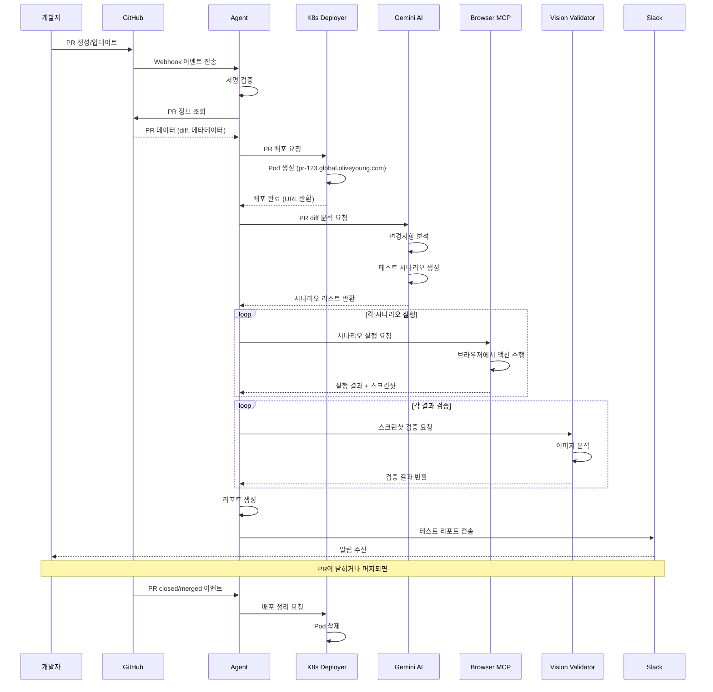
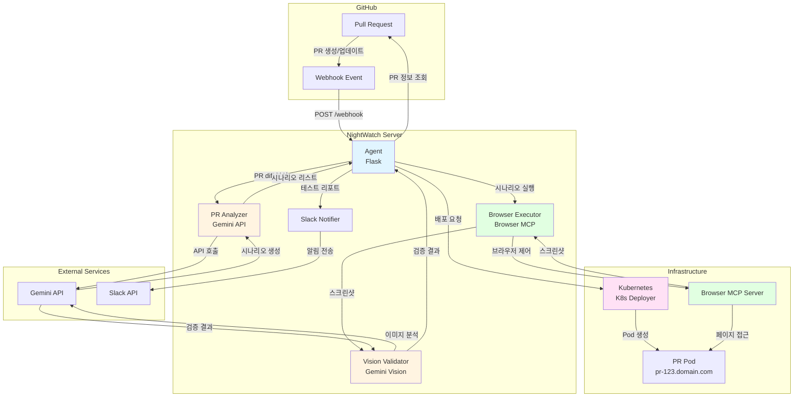
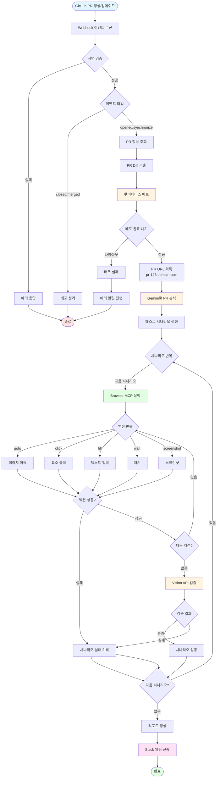
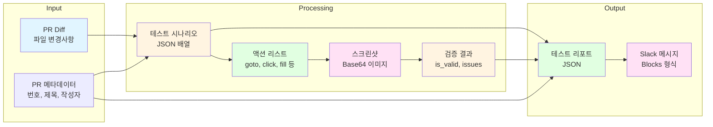
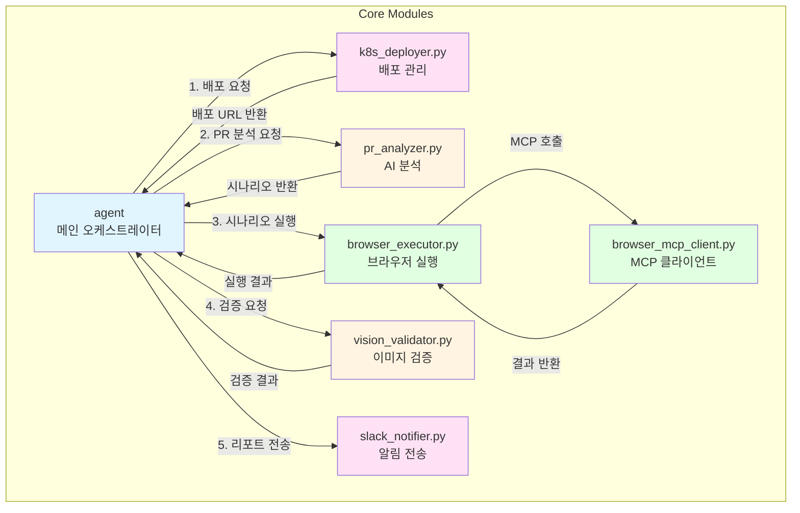
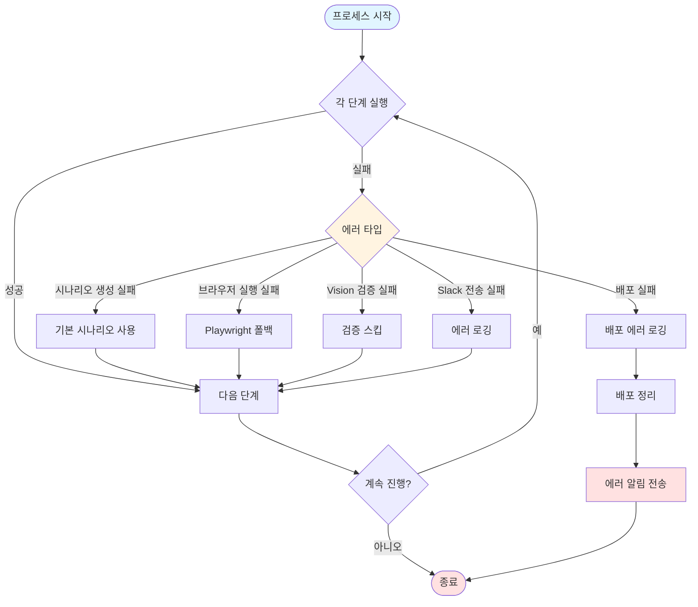
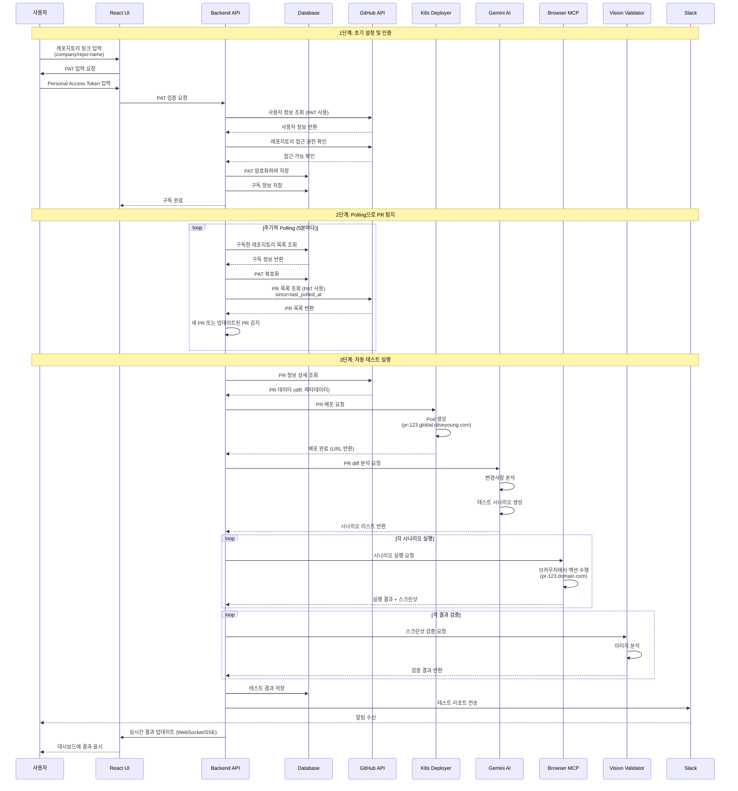
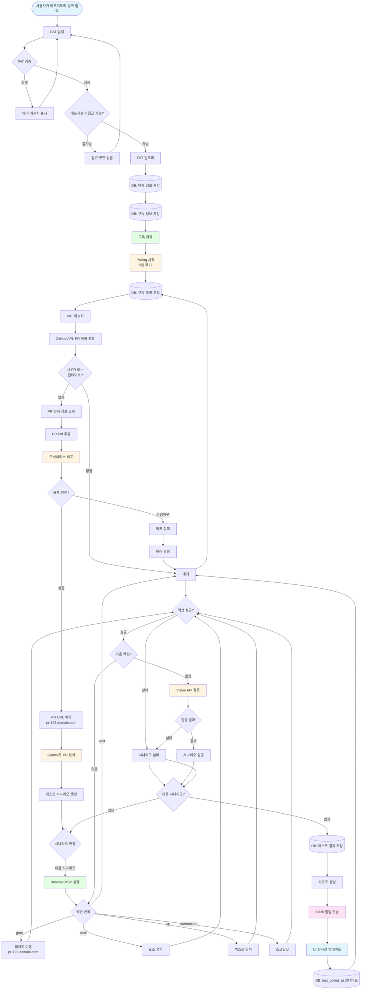
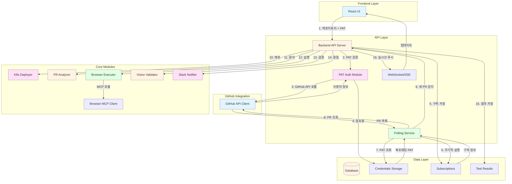

# 나이트워치 프로젝트 - 다이어그램

## 📊 전체 워크플로우 (시퀀스 다이어그램)



## 🏗️ 시스템 아키텍처 (컴포넌트 다이어그램)



## 🔄 상세 프로세스 플로우 (플로우차트)



## 📦 데이터 플로우 다이어그램



## 🔌 컴포넌트 상호작용 다이어그램



## 🎯 에러 처리 플로우



---

## 🔐 PAT 기반 레포지토리 구독 시스템 (최종 버전)

### 전체 워크플로우 (PAT + Polling 방식)



### 시스템 아키텍처 (PAT + Polling)

```mermaid
graph TB
    subgraph "Frontend"
        UI[React UI<br/>레포지토리 구독 관리]
    end

    subgraph "Backend API"
        API[Flask/FastAPI Server]
        Auth[PAT 인증 모듈]
        Poll[Polling Scheduler]
        WS[WebSocket/SSE Server]
    end

    subgraph "Database"
        DB[(Database)]
        Creds[user_credentials<br/>암호화된 PAT]
        Subs[subscriptions<br/>구독 정보]
        Tests[tests<br/>테스트 기록]
    end

    subgraph "GitHub"
        GH_API[GitHub API]
        REPO[Repository]
        PR[Pull Requests]
    end

    subgraph "NightWatch Core"
        K8S[K8s Deployer]
        PA[PR Analyzer]
        BE[Browser Executor]
        BMCP[Browser MCP Client]
        VV[Vision Validator]
        SN[Slack Notifier]
    end

    subgraph "External Services"
        GEMINI[Gemini API]
        MCP_SERVER[Browser MCP Server]
        SLACK[Slack API]
        K8S_CLUSTER[Kubernetes Cluster]
    end

    UI -->|1. 레포지토리 링크 + PAT 입력| API
    API -->|2. PAT 검증| GH_API
    GH_API -->|사용자 정보| API
    API -->|3. PAT 암호화 저장| Creds
    API -->|4. 구독 정보 저장| Subs

    Poll -->|5. 주기적 조회 (5분)| DB
    DB -->|구독 정보| Poll
    Poll -->|6. PAT 복호화| Creds
    Poll -->|7. PR 목록 조회| GH_API
    GH_API -->|PR 목록| Poll

    Poll -->|8. 새 PR 감지| API
    API -->|9. PR 상세 조회| GH_API
    GH_API -->|PR diff| API

    API -->|10. 배포 요청| K8S
    K8S -->|Pod 생성| K8S_CLUSTER
    K8S_CLUSTER -->|pr-123.domain.com| K8S

    API -->|11. PR 분석| PA
    PA -->|API 호출| GEMINI
    GEMINI -->|시나리오| PA

    API -->|12. 시나리오 실행| BE
    BE -->|MCP 호출| BMCP
    BMCP -->|브라우저 제어| MCP_SERVER
    MCP_SERVER -->|페이지 접근| K8S_CLUSTER
    MCP_SERVER -->|스크린샷| BMCP

    BE -->|13. 스크린샷 검증| VV
    VV -->|이미지 분석| GEMINI
    GEMINI -->|검증 결과| VV

    API -->|14. 결과 저장| Tests
    API -->|15. 리포트 전송| SN
    SN -->|알림| SLACK

    API -->|16. 실시간 업데이트| WS
    WS -->|푸시| UI

    style UI fill:#e1f5ff
    style API fill:#fff4e1
    style Auth fill:#ffe1f5
    style Poll fill:#e1ffe1
    style DB fill:#fff4e1
    style K8S fill:#ffe1f5
    style PA fill:#fff4e1
    style BE fill:#e1ffe1
    style VV fill:#fff4e1
    style SN fill:#ffe1f5
```

### 상세 프로세스 플로우 (PAT + Polling)



### 데이터 플로우 (PAT + 구독 시스템)

```mermaid
graph LR
    subgraph "User Input"
        REPO_LINK[레포지토리 링크<br/>company/repo-name]
        PAT_INPUT[Personal Access Token<br/>ghp_xxxxx]
    end

    subgraph "Authentication"
        PAT_VERIFY[PAT 검증<br/>GitHub API]
        PAT_ENCRYPT[PAT 암호화<br/>AES-256]
        PAT_STORE[(암호화된 PAT<br/>DB 저장)]
    end

    subgraph "Subscription"
        SUB_INFO[구독 정보<br/>repo, options]
        SUB_STORE[(구독 정보<br/>DB 저장)]
    end

    subgraph "Polling"
        POLL_SCHEDULE[Polling 스케줄러<br/>5분 주기]
        PAT_DECRYPT[PAT 복호화]
        PR_LIST[PR 목록 조회<br/>GitHub API]
        PR_DETECT[새 PR 감지]
    end

    subgraph "Processing"
        PR_DIFF[PR Diff]
        SCENARIOS[테스트 시나리오]
        ACTIONS[브라우저 액션]
        SCREENSHOTS[스크린샷]
        VALIDATION[검증 결과]
    end

    subgraph "Output"
        TEST_RESULTS[(테스트 결과<br/>DB 저장)]
        REPORT[리포트]
        SLACK_MSG[Slack 알림]
        UI_UPDATE[UI 실시간 업데이트]
    end

    REPO_LINK --> PAT_VERIFY
    PAT_INPUT --> PAT_VERIFY
    PAT_VERIFY --> PAT_ENCRYPT
    PAT_ENCRYPT --> PAT_STORE
    REPO_LINK --> SUB_INFO
    SUB_INFO --> SUB_STORE

    SUB_STORE --> POLL_SCHEDULE
    POLL_SCHEDULE --> PAT_DECRYPT
    PAT_STORE --> PAT_DECRYPT
    PAT_DECRYPT --> PR_LIST
    PR_LIST --> PR_DETECT

    PR_DETECT --> PR_DIFF
    PR_DIFF --> SCENARIOS
    SCENARIOS --> ACTIONS
    ACTIONS --> SCREENSHOTS
    SCREENSHOTS --> VALIDATION

    VALIDATION --> TEST_RESULTS
    TEST_RESULTS --> REPORT
    REPORT --> SLACK_MSG
    TEST_RESULTS --> UI_UPDATE

    style REPO_LINK fill:#e1f5ff
    style PAT_INPUT fill:#ffe1e1
    style PAT_VERIFY fill:#fff4e1
    style PAT_ENCRYPT fill:#fff4e1
    style POLL_SCHEDULE fill:#e1ffe1
    style PR_DETECT fill:#e1ffe1
    style SCENARIOS fill:#fff4e1
    style ACTIONS fill:#e1ffe1
    style VALIDATION fill:#fff4e1
    style REPORT fill:#e1ffe1
    style SLACK_MSG fill:#ffe1f5
    style UI_UPDATE fill:#e1f5ff
```



### 컴포넌트 상호작용 (PAT 기반)


